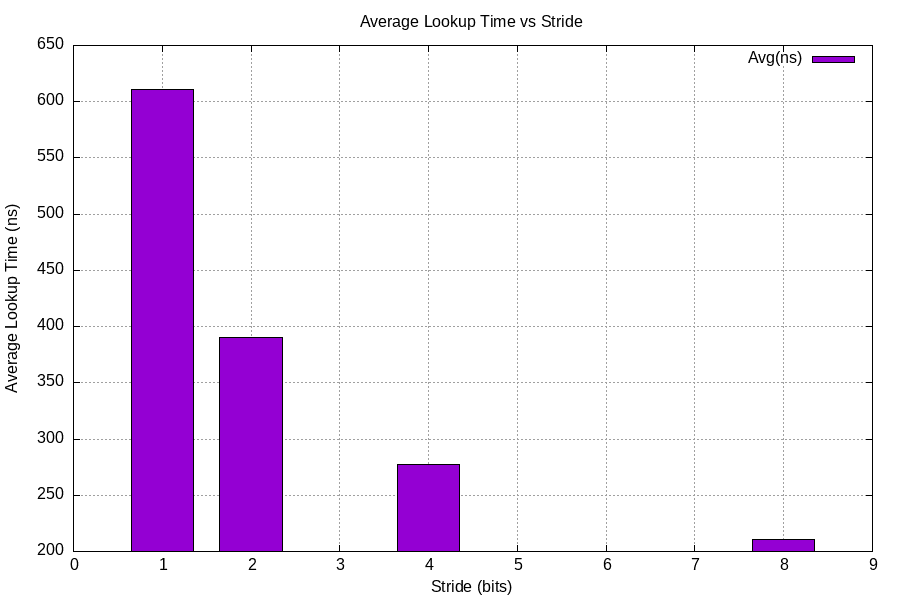
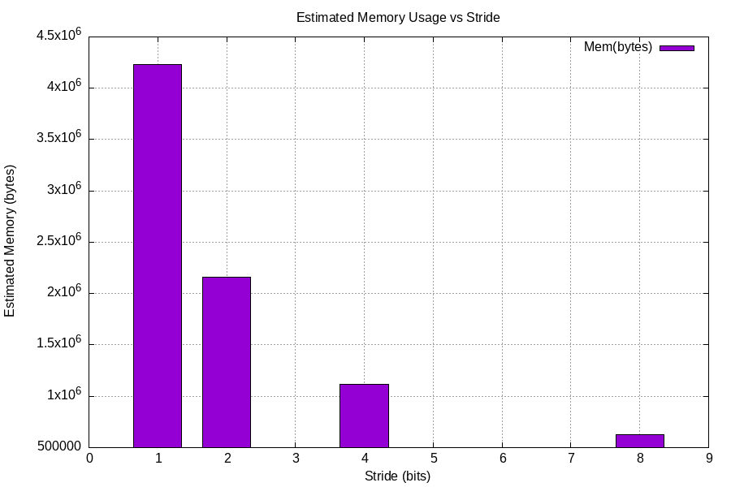

# Multi-Bit Trie Based IPv4 Longest Prefix Match

An experimental and performance-oriented implementation of **IPv4 Longest Prefix Match (LPM)** using a **Multi-Bit Trie** data structure with configurable stride sizes.
The project focuses on correctness, performance evaluation, and memory analysis of different stride configurations under realistic workloads.

---

## Abstract

Longest Prefix Match (LPM) is the core operation performed by IP routers to select the appropriate next hop for each destination address.
Although binary tries guarantee correctness, they often suffer from deep traversal paths and poor cache behavior.

Multi-Bit Tries address this limitation by examining multiple bits per level, reducing trie depth while increasing node fan-out.
This project implements a Multi-Bit Trie for IPv4 routing and provides a **quantitative evaluation** of stride sizes **1, 2, 4, and 8**
in terms of lookup latency, memory usage, and construction cost.

---

## Key Contributions

- Correct implementation of IPv4 Longest Prefix Match using a Multi-Bit Trie
- Experimental comparison of stride sizes (1, 2, 4, and 8)
- Nanosecond-level lookup latency measurement
- Reproducible, file-based evaluation pipeline
- Automatic CSV generation for raw and aggregated results
- Automatic performance and memory visualization
- Verified stride-independent correctness

---

## Project Structure

```
.
├── main.cpp
├── random-generator.py
├── prefix-list.txt
├── prefix-list2.txt
├── README.md
└── .gitignore
```

---

## Input Specification

### Routing Table (`prefix-list.txt`)

Each line represents a routing entry in the form:

```
<prefix_hex> <prefix_length> <next_hop>
```

- `prefix_hex` — IPv4 prefix in hexadecimal notation
- `prefix_length` — Prefix length in the range 0–32
- `next_hop` — Integer identifier of the output interface

Example:

```
0A000000 8 5410
```

---

### Destination Addresses (`addresses-100000.txt`)

Each line contains one IPv4 destination address in hexadecimal notation:

```
02C4FA21
```

---

## Experimental Methodology

For each stride value (1, 2, 4, and 8), the following procedure is executed:

1. Read the routing table from file
2. Construct a Multi-Bit Trie with the selected stride
3. Load randomly generated IPv4 destination addresses
4. Perform Longest Prefix Match lookup for each address
5. Measure per-lookup latency using a high-resolution clock
6. Record per-lookup results
7. Aggregate statistics per stride
8. Export all data to CSV files
9. Generate plots for visual comparison

---

## Build and Execution

### Requirements

- Linux (Ubuntu / Debian / WSL recommended)
- GCC with C++17 support
- gnuplot
- Python 3

Install dependencies:

```bash
sudo apt update
sudo apt install build-essential gnuplot python3
```

---

### Build

```bash
g++ -O2 -std=c++17 -o trie main.cpp
```

---

### Random Address Generation

```bash
python3 random-generator.py
```

This generates:

```
addresses-100000.txt
```

---

### Run Experiments

#### Full Performance Evaluation

```bash
./trie prefix-list.txt addresses-100000.txt
```

#### Correctness Test (Small Dataset)

```bash
./trie prefix-list2.txt addresses.txt
```

---

## Output Files

### lookup_results.csv

Per-lookup results:

```
stride,address_hex,next_hop,time_ns
```

Used for:
- Correctness verification
- Latency distribution analysis
- Cross-stride consistency checks

---

### summary.csv

Aggregated statistics per stride, including:

- Number of prefixes loaded
- Trie node and edge counts
- Trie construction time
- Lookup latency statistics (min / max / average / standard deviation)
- Estimated memory usage

This file is the primary source for evaluation and plotting.

---

## Evaluation and Results

All evaluation results presented below are directly derived from `summary.csv` and visualized using automatically generated plots.

### Lookup Latency Analysis

The average lookup latency for each stride configuration is summarized below:

```
Stride  Avg Lookup Time (ns)
1       ≈ 610
2       ≈ 390
4       ≈ 278
8       ≈ 210
```

Increasing the stride consistently reduces lookup latency by decreasing trie depth and the number of memory accesses.
Stride 8 achieves approximately **2.9× faster lookups** compared to stride 1.

The following figure visualizes this trend:



---

### Memory Usage Analysis

Estimated memory consumption of the trie for each stride is shown below:

```
Stride  Estimated Memory Usage
1       ≈ 4.23 MB
2       ≈ 2.16 MB
4       ≈ 1.12 MB
8       ≈ 0.62 MB
```

As the stride increases, the total number of trie nodes and edges decreases significantly, leading to lower memory usage.

The memory usage comparison is illustrated in the following figure:



---

### Trie Size and Construction Cost

Larger stride values result in shallower tries and reduced construction time due to fewer node allocations.
This behavior matches the expected theoretical properties of Multi-Bit Tries.

---

### Correctness Validation

Correctness is validated by comparing lookup results across all stride configurations:

- Each destination address yields the **same next hop** for strides 1, 2, 4, and 8
- Validation is performed using `lookup_results.csv`
- This confirms that performance optimizations do not compromise Longest Prefix Match correctness

---

## Discussion

The experimental results confirm the expected trade-offs of Multi-Bit Tries:

- Higher stride values significantly improve lookup performance
- Memory usage decreases with increasing stride
- The overhead of wider nodes is outweighed by reduced traversal depth
- Stride 8 provides the best overall performance for the evaluated routing table

---

## Limitations

- Memory usage values are estimated and allocator-dependent
- Lookup latency may be affected by cache behavior and OS scheduling
- Only IPv4 routing is considered; IPv6 is not evaluated

---

## License

This project is intended for educational and academic use.
